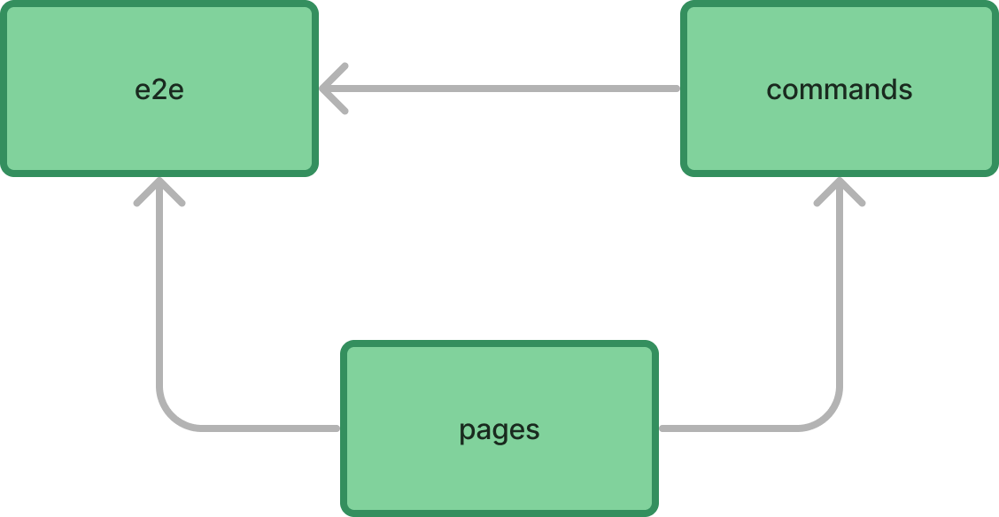

# Stuff shop tests
Cypress example tests that test simple REST application.

## Application under test
### Frontend:
Simple Vue app
- Code: https://github.com/FC122/StuffShop
- Deploy: https://stuff-shop.onrender.com/

### Backend
Simple mock backend with json server
- Code: https://github.com/FC122/JsonServer
- Deploy docs: https://stuffshopserver.onrender.com/

## Tests
Simple cypress tests
### POM

- e2e - contains tests and uses commands and pages
- commands - contains commands and uses pages
- pages - contain objects that contain page elements

## Usage:
### Requirements
- npm 10.2.4
- node v20.11.1
### Steps
Clone:
```js
git clone https://github.com/FC122/stuffShopTest.git
```

Run:
```js
npm i
```

To open cypress UI in the folder where cypress.config.js is run:
```js
npx cypress open
```

To run tests:
```js
npm run test
```

## Test report
Generated by github actions accessible at:
https://fc122.github.io/stuffShopTest/